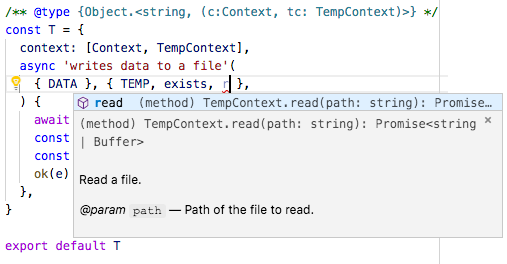

# @wrote/temp-context

[](https://npmjs.org/package/@wrote/temp-context)

`@wrote/temp-context` is a test context to create and erase temp directories.

```sh
yarn add -E @wrote/temp-context
```

<p align="center"><a href="#table-of-contents"></a></p>

## Table Of Contents

- [Table Of Contents](#table-of-contents)
- [API](#api)
- [**class `TempContext`**](#class-tempcontext)
  * [get `TEMP`](#get-temp)
  * [`async exists(path: string): boolean`](#async-existspath-string-boolean)
  * [`resolve(path: string): string`](#resolvepath-string-string)
  * [`async read(path: string): string`](#async-readpath-string-string)
  * [`async readGlobal(path: string): string`](#async-readglobalpath-string-string)
  * [`async write(data: string, path: string): string`](#async-writedata-stringpath-string-string)
  * [`async clone(from: string, to: boolean)`](#async-clonefrom-stringto-boolean-void)
  * [`async rm(path: string)`](#async-rmpath-string-void)
  * [`async snapshot(innerPath?: string): string`](#async-snapshotinnerpath-string-string)
- [**Example**](#example)
  * [Masks](#masks)
  * [Specs](#specs)
  * [Output](#output)
  * [Autocompletion](#autocompletion)
- [**Extending**](#extending)
- [TODO](#todo)
- [Copyright](#copyright)

<p align="center"><a href="#table-of-contents"></a></p>

## API

The package is available by importing its default function:

```js
import tempContext from '@wrote/temp-context'
```

<p align="center"><a href="#table-of-contents"></a></p>

## **class `TempContext`**

Instances of this test context class will create a `temp` directory in the `test` folder on initialisation, and remove it at the end of each test. To change the location of the test directory, [extend the class](#extending).

The test context is used with the _Zoroaster_ testing framework, which will initialise and destroy it for every test. Check the [example](#example) section to see how tests are implemented.

### get `TEMP`

Return the path to the temp folder.

### `async exists(`<br/>&nbsp;&nbsp;`path: string,`<br/>`): boolean`

Checks if the path exists.

### `resolve(`<br/>&nbsp;&nbsp;`path: string,`<br/>`): string`

Resolve a path inside of the temp directory, e.g., `resolve('data.temp')` will return `test/temp/data.temp`.

### `async read(`<br/>&nbsp;&nbsp;`path: string,`<br/>`): string`

Read the file in the temp directory and returns its contents.

### `async readGlobal(`<br/>&nbsp;&nbsp;`path: string,`<br/>`): string`

Read the file given its path and returns its contents. Alias for [`@wrote/read`](https://github.com/wrote/read).

### `async write(`<br/>&nbsp;&nbsp;`data: string,`<br/>&nbsp;&nbsp;`path: string,`<br/>`): string`

Write to the file in the temp directory and return its path.

### `async clone(`<br/>&nbsp;&nbsp;`from: string,`<br/>&nbsp;&nbsp;`to: boolean,`<br/>`): void`

Clone a file or directory to the specified location. Alias from [`@wrote/clone`](https://github.com/wrote/clone).

### `async rm(`<br/>&nbsp;&nbsp;`path: string,`<br/>`): void`

Remove a file or folder inside of the temp directory. Alias from [`@wrote/clone`](https://github.com/wrote/rm).

### `async snapshot(`<br/>&nbsp;&nbsp;`innerPath?: string,`<br/>`): string`

Takes a snapshot of the temp directory, which can then be saved and tested either with _Zoroaster_ masks or [`snapshot-context`](https://github.com/artdecocode/snapshot-context).

<p align="center"><a href="#table-of-contents"></a></p>

## **Example**

_Zoroaster_ tests can be written either as masks, or more traditionally as specs. For example, a program might want to write given data to a file in a specified directory, as so:

```js
import { join } from 'path'
import { createWriteStream } from 'fs'

/**
 * Writes given data to a hidden file.
 * @param {string} path Path to the directory where to create a file.
 * @param {string} data Data to write.
 */
const program = (path, data) => {
  const j = join(path, '.test')
  const rs = createWriteStream(j)
  rs.end(`hello world: ${data}`)
}

export default program
```

When writing tests with _Zoroaster_, the project dir will have the `src` and `test` directories:

```m
example
├── src
│   └── index.js
└── test
    ├── context
    │   ├── index.js
    │   └── temp.js
    ├── mask
    │   └── default.js
    ├── result
    │   └── index.md
    └── spec
        ├── default.js
        └── extended.js
```

### Masks

To implement tests with masks, a mask implementation should be set up in the `mask` directory:

```js
import { makeTestSuite } from 'zoroaster'
import TempContext from 'temp-context'
import program from '../../src'

/**
 * This test suite will clone an input and take a snapshot of the temp directory.
 */
const ts = makeTestSuite('example/test/result', {
  /**
   * @param {string} input
   * @param {TempContext} context
   */
  async getResults(input, { TEMP, snapshot }) {
    await program(TEMP, input)
    const s = await snapshot()
    return s
  },
  context: TempContext,
})

export default ts
```

The results file which contains data about how input should be mapped to the output is saved in the `results` directory:

```md
// creates a file in the temp directory
input data

/* expected */
# .test

hello world: input data
/**/
```

Now when run, `zoroaster` will use the mask test suite (generated with the `makeTestSuite` function) to check that inputs match expected outputs.

### Specs

Occasionally, there are times when masks are not flexible enough to run tests. Specs are individual test cases, and can access test contexts assigned to the `context` property of a test suite.

```js
import TempContext from 'temp-context'
import { ok, equal } from 'zoroaster/assert'
import Context from '../context'
import program from '../../src'

/** @type {Object.<string, (c:Context, tc: TempContext)>} */
const T = {
  context: [Context, TempContext],
  async 'writes data to a file'(
    { DATA }, { TEMP, resolve, exists, read },
  ) {
    await program(TEMP, DATA)
    const j = resolve('.test')
    console.log('Temp file location: %s', j)
    const e = await exists(j)
    ok(e)
    const res = await read('.test')
    equal(res, `hello world: ${DATA}`)
  },
}

export default T
```

### Output

The outcome of all the above tests can be achieved with `zoroaster -a example/test/spec example/test/mask` command, where `-a` is used to require [`alamode`](https://alamode.cc) -- a fast RegExp-based transpiler of `import` and `export` statements.

```
example/test/spec/default.js
Temp file location: test/temp/.test
  ✓  writes data to a file
 example/test/mask
   index.md
    ✓  creates a file in the temp directory

🦅  Executed 2 tests.
```

### Autocompletion

One of the advantages of using test context is that they are well documented and it's possible to get auto-completes for available methods when using destructuring on the context argument to a test case, both in masks as well as in specs.



<p align="center"><a href="#table-of-contents"></a></p>

## **Extending**

Extending the `TempContext` allows to set the specific temp directory location, and/or add additional methods without having to have 2 contexts for testing.

```js
import TempContext from 'temp-context'

export default class MyTempContext extends TempContext {
  constructor() {
    super()
    this._useOSTemp('package-test')
  }
  get DATA() {
    return 'test-data'
  }
}
```

```js
import { ok, equal } from 'zoroaster/assert'
import MyTempContext from '../context/temp'
import program from '../../src'

/** @type {Object.<string, (tc: MyTempContext)>} */
const T = {
  context: MyTempContext,
  async 'writes data to a file'(
    { TEMP, resolve, exists, read, DATA },
  ) {
    await program(TEMP, DATA)
    const j = resolve('.test')
    const e = await exists(j)
    console.log('Temp file location: %s', j)
    ok(e)
    const res = await read('.test')
    equal(res, `hello world: ${DATA}`)
  },
}

export default T
```
```
example/test/spec/extended.js
Temp file location: /var/folders/sv/4z6rm3dj38588dwj1pgz04580000gn/T/package-test/.test
  ✓  writes data to a file

🦅  Executed 1 tests.
```

<p align="center"><a href="#table-of-contents"></a></p>

## TODO

- [ ] Create `fs` context and extend it.
- [ ] Test the `read` method.
- [ ] Show the example output with the terminal.

## Copyright

(c) [Wrote][1] 2018

[1]: https://wrote.cc

<p align="center"><a href="#table-of-contents"></a></p>